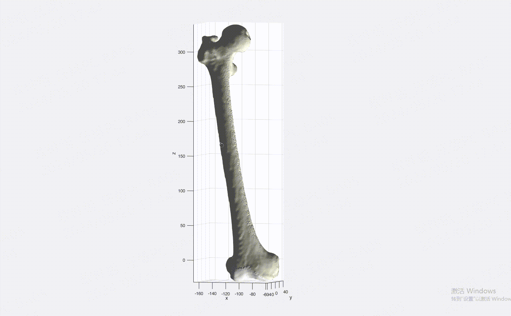
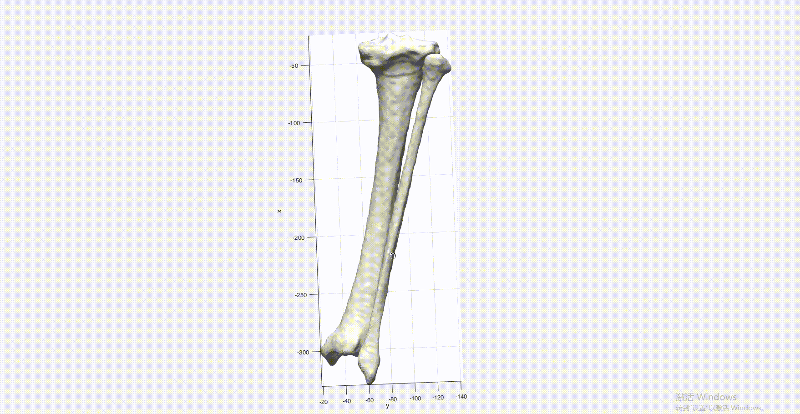

# 基于统计形状模型预测软骨

## 方法原理简介
1. 平均模型建立  
     通过统计形状模型，建立了平均的股骨、胫骨、股骨软骨、胫骨内侧、胫骨外侧、髌骨等软骨及半月板、前交叉韧带、
后交叉韧带以及膝关节韧带的平均模型。  

2. 预测  
     预测的时候，要求输入的点云与统计的平均点云是一一对应的（这在实际使用的时候，不好操作，只能使用ICP初步对齐）。  
然后利用普氏分析，计算输入点云和目标点云之间的变换矩阵、缩放系数。然后将对应的软骨点云的厚度（统计的平均软骨点云）  
乘以该变换系数。从输入的点云中，找到对应的软骨点云（是从统计的软骨点云的index，对应到输入点云），将该点云按照软骨  
的厚度，沿着发现方向，往外扩，就预测得到了输入点云的软骨。

3. 实际预测情况
   有对输入点云有要求，难以与统计的点云那样的点一一对应，导致实际预测的结果误差偏大。实际使用效果差。如下图，预测
的股骨软骨。软骨跑到了股骨外侧上。用好该模型的关键是，如何提高对应点的预测精度。

