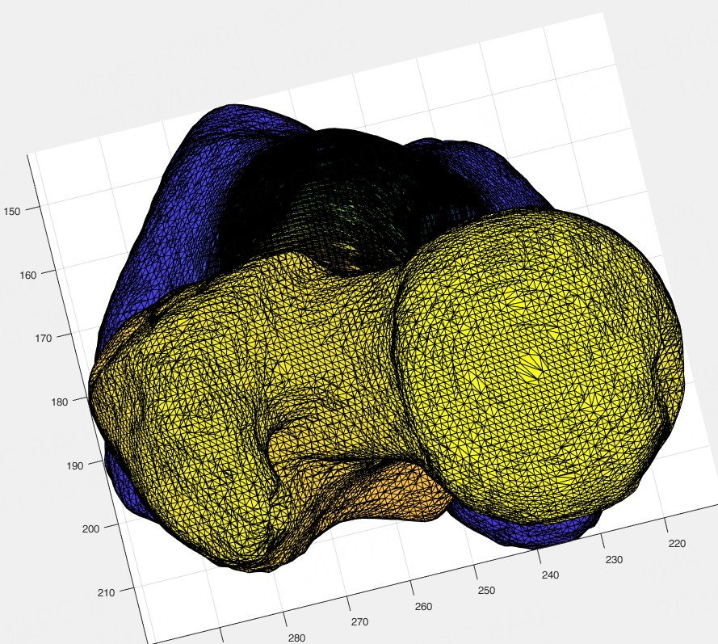
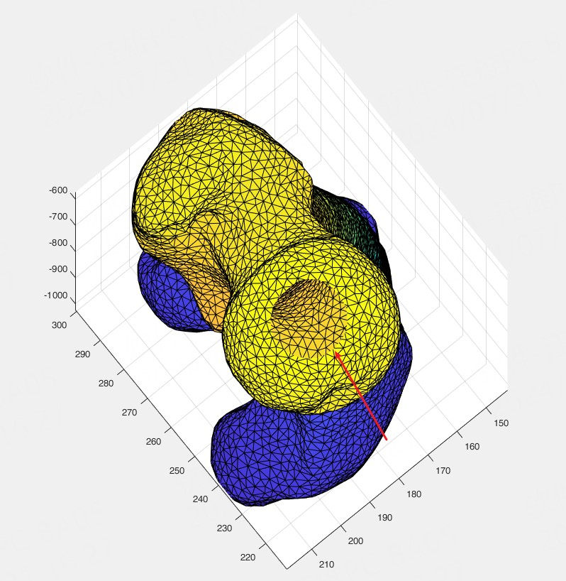

#对stl的重新绘制

##绘制效果对比
原效果

重绘后的效果

    重绘后，出现孔洞
    孔洞修复参考https://github.com/kentechx/hole-filling
    这个不是稳定出现的。

##reference:
    https://ww2.mathworks.cn/matlabcentral/fileexchange/49691-patch-remesher?s_tid=prof_contriblnk

##stl文件的读写参考
    https://ww2.mathworks.cn/matlabcentral/fileexchange/51200-stltools