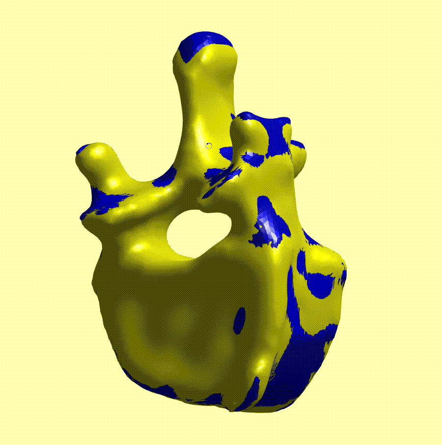

#基于ICP的三维点云刚性配准Demo

##待配准的两个stl

##配准后的结果

##使用说明
    直接运行main.m文件即可，输入是两个待配准的stl文件。
    
##reference:
    matlab file exchange
    https://ww2.mathworks.cn/matlabcentral/fileexchange/40888-rigid-icp-registration?s_tid=prof_contriblnk